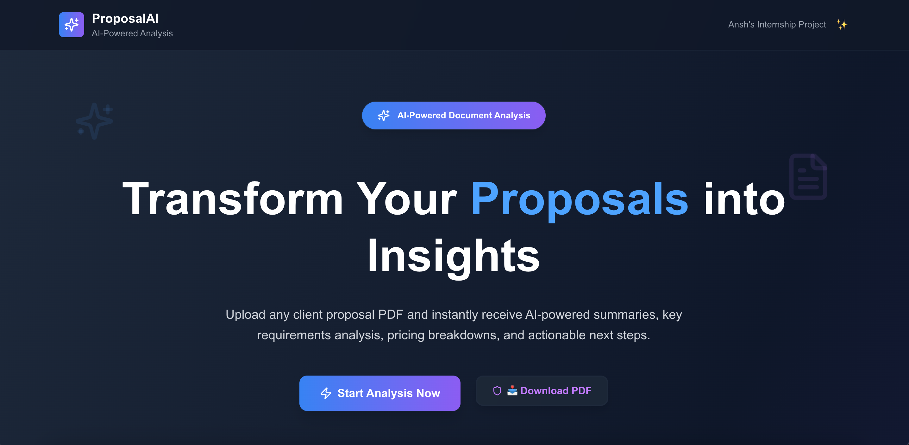
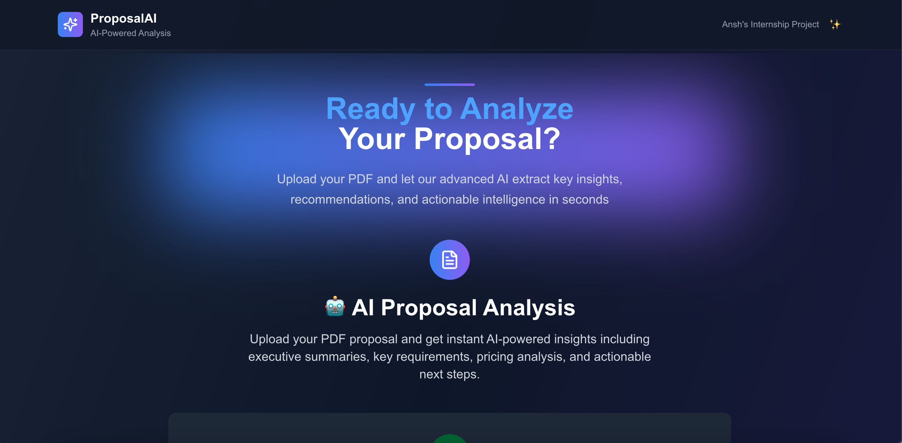
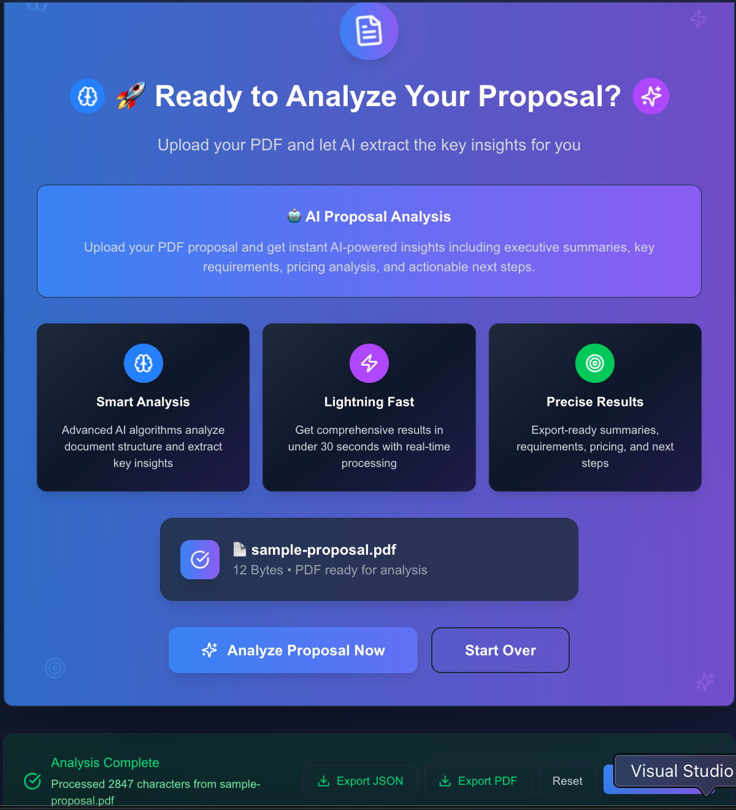
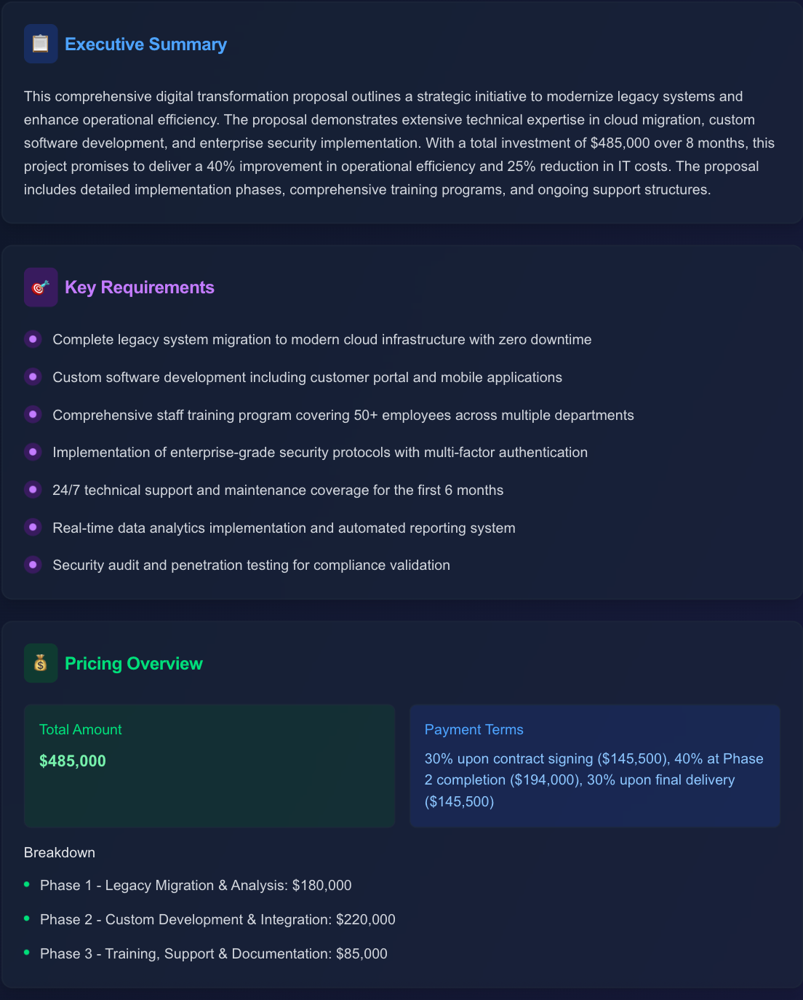

# 🤖 AI Proposal Summarizer - Ansh's Internship Project

A modern, full-stack web application that transforms client proposals (PDFs) into actionable insights using AI-powered analysis. Built with Next.js 15, TypeScript, and OpenAI's GPT-4.

## 📁 Deliverables Structure

This GitHub repository contains the following deliverables as specified:

```
internship-project/
├── backend/                     # All backend source code
│   ├── src/
│   │   └── server.js           # Main server file with OpenAI integration
│   ├── package.json            # Dependencies and scripts
│   └── .env.example            # Environment variables template
├── frontend/                   # All frontend source code
│   ├── src/
│   │   ├── app/               # App Router pages and layouts
│   │   ├── components/        # Reusable UI components
│   │   └── lib/              # Utility functions
│   ├── package.json          # Dependencies and build scripts
│   ├── tailwind.config.js    # Tailwind CSS configuration
│   └── tsconfig.json         # TypeScript configuration
├── Sample PDF/                 # Dummy proposal PDF for testing
│   └── sample-proposal.pdf    # Demo proposal PDF
└── README.md                   # Documentation with build instructions
```

## 🚀 Build and Run Instructions

### Prerequisites

- Node.js 18+ installed
- OpenAI API key (optional - runs in demo mode without it)

### Step 1: Install Dependencies

```bash
# Navigate to project directory
cd internship-project

# Install backend dependencies
cd backend
npm install

# Install frontend dependencies
cd ../frontend
npm install
```

### Step 2: Environment Configuration (Optional)

```bash
# In the backend directory
cd backend
cp .env.example .env

# Edit .env file and add your OpenAI API key (optional)
OPENAI_API_KEY=your_openai_api_key_here
PORT=5001
```

**Note**: The application runs in demo mode if no OpenAI API key is provided.

### Step 3: Build and Run Both Frontend & Backend

#### Development Mode (Recommended)

```bash
# Terminal 1 - Start Backend (from project root)
cd backend
npm start
# Backend will run on http://localhost:5001

# Terminal 2 - Start Frontend (from project root)
cd frontend
npm run dev
# Frontend will run on http://localhost:3000
```

#### Production Build

```bash
# Build frontend for production
cd frontend
npm run build
npm start

# Backend for production
cd backend
npm start
```

### Step 4: Access the Application

- **Frontend**: Open http://localhost:3000 in your browser
- **Backend API**: Available at http://localhost:5001
- **Health Check**: http://localhost:5001/api/health

## 📸 UI Screenshots

### Homepage - Hero Section



### File Upload Interface





### AI Analysis Results



## 🧠 Prompt Design Approach

### AI Analysis Strategy

The AI analysis uses a carefully engineered prompt designed to extract maximum business value from proposals:

```javascript
const analysisPrompt = `
You are a senior business analyst. Analyze this proposal document and provide a comprehensive breakdown in JSON format.

REQUIRED OUTPUT STRUCTURE:
{
  "executiveSummary": "3-5 sentence professional summary focusing on main goals and value proposition",
  "keyRequirements": ["List of specific deliverables, timeline, and success metrics"],
  "pricingOverview": {
    "totalAmount": "Total cost with currency",
    "breakdown": ["Itemized cost breakdown with descriptions"],
    "paymentTerms": "Payment schedule and terms"
  },
  "recommendedNextSteps": ["Actionable next steps for moving forward with specific deadlines"]
}

ANALYSIS GUIDELINES:
- Focus on business value and actionable insights
- Extract exact pricing when available, provide estimates when unclear
- Use professional business language
- If information is missing, indicate "Not specified" rather than assumptions
- Prioritize insights that help decision-makers evaluate the proposal
`;
```

### Key Design Principles

1. **Structured Output**: Consistent JSON format ensures reliable parsing and display
2. **Business-Focused**: Emphasis on actionable insights for sales teams and decision-makers
3. **Comprehensive Coverage**: Covers all critical business aspects (summary, requirements, pricing, next steps)
4. **Error Handling**: Graceful handling of missing or unclear information
5. **Professional Tone**: Business-appropriate language suitable for executive audiences
6. **Scalable Format**: Designed to work with various proposal types and formats

## ⚠️ PDF Parsing Challenges & Edge Cases

### Major Challenges Encountered

#### 1. Complex PDF Layouts

- **Challenge**: Multi-column layouts, embedded tables, and images affecting text extraction order
- **Solution**: Implemented pdf-parse with text extraction optimization and post-processing cleanup to maintain logical reading order

#### 2. File Format Variations

- **Challenge**: Different PDF versions, password-protected files, corrupted documents, and scanned images
- **Solution**: Comprehensive error handling with specific error messages, file validation, and graceful fallbacks

#### 3. Memory and Performance Issues

- **Challenge**: Large files causing memory limitations and slow processing times
- **Solution**: 10MB file size limit, streaming processing, async handling, and user progress indicators

#### 4. Text Encoding Problems

- **Challenge**: Special characters, non-UTF8 encoding, and formatting inconsistencies
- **Solution**: Buffer handling, character encoding detection, text normalization, and cleanup algorithms

#### 5. Security Considerations

- **Challenge**: Preventing malicious uploads and ensuring safe file processing
- **Solution**: File type validation, size limits, sandboxed processing, and secure temporary file handling

### Edge Cases Successfully Handled

- **Empty PDFs**: Detection and user notification with actionable feedback
- **Image-only PDFs**: Clear messaging about OCR requirements
- **Password-protected files**: Specific error handling with user guidance
- **Corrupted files**: Graceful error recovery with detailed error messages
- **Network timeouts**: Retry mechanisms and user-friendly timeout handling
- **API rate limiting**: Queue management and user feedback during high usage
- **Malformed JSON responses**: Response validation and error recovery
- **Concurrent uploads**: File processing queue and resource management

### Technical Solutions Implemented

```javascript
// Example error handling for PDF parsing
try {
  const pdfBuffer = await multer.memoryStorage();
  const pdfData = await pdfParse(pdfBuffer);

  if (!pdfData.text || pdfData.text.trim().length < 50) {
    throw new Error("PDF appears to be empty or image-only");
  }

  // Text cleanup and normalization
  const cleanText = pdfData.text
    .replace(/\s+/g, " ")
    .replace(/[^\x20-\x7E\s]/g, "")
    .trim();
} catch (error) {
  return res.status(400).json({
    error: "PDF_PARSE_ERROR",
    message: getErrorMessage(error),
    suggestions: getErrorSuggestions(error),
  });
}
```

## 📋 Sample PDF

The `Sample PDF/sample-proposal.pdf` file contains a realistic business proposal including:

- **Executive Summary**: Company overview and project objectives
- **Technical Requirements**: Detailed specifications and deliverables
- **Timeline**: Project phases with milestones and deadlines
- **Pricing Structure**: Comprehensive cost breakdown and payment terms
- **Terms & Conditions**: Legal and business terms

This sample demonstrates the full capabilities of the AI analysis system and serves as a testing baseline.

## ✨ Key Features

- **📄 Smart PDF Parsing**: Extract text from any PDF proposal format
- **🧠 AI-Powered Analysis**: Comprehensive summaries using OpenAI GPT-4
- **⚡ Real-time Processing**: Analysis results in under 30 seconds
- **🎨 Premium UI/UX**: Modern dark theme with glassmorphism effects
- **🔒 Secure**: File validation, size limits, and error handling
- **📊 Structured Output**: Executive summaries, requirements, pricing, and next steps
- **💾 Export Options**: Download results as JSON or PDF
- **📱 Responsive Design**: Works on desktop, tablet, and mobile
- **🚀 Performance Optimized**: Fast loading and smooth interactions

## 🛠️ Technology Stack

### Frontend

- **Next.js 15** - React framework with App Router
- **TypeScript** - Type safety and development experience
- **Tailwind CSS** - Utility-first CSS framework
- **Framer Motion** - Smooth animations (optimized for performance)
- **React Dropzone** - File upload handling
- **shadcn/ui** - High-quality UI components

### Backend

- **Node.js & Express** - Server framework
- **OpenAI API (GPT-4)** - AI document analysis
- **PDF-Parse** - PDF text extraction
- **Multer** - File upload middleware
- **Helmet** - Security middleware
- **CORS** - Cross-origin resource sharing

---

**Built with ❤️ by Ansh Khandelwal for the internship project**

_This project demonstrates full-stack development skills including modern React/Next.js, Node.js backend development, AI integration, premium UI/UX design, and production-ready code practices._

### AI Analysis Results


### Sample PDF Viewer


## 🧠 AI Prompt Design Approach

### Prompt Engineering Strategy

The AI analysis uses a carefully crafted prompt designed to extract maximum value from business proposals:

```javascript
const analysisPrompt = `
Analyze this business proposal and provide a comprehensive breakdown:

EXECUTIVE SUMMARY (3-5 sentences):
- Main purpose and goals
- Key value proposition
- Overall scope

KEY REQUIREMENTS & ASK:
- Specific deliverables requested
- Timeline and milestones
- Success metrics

PRICING OVERVIEW:
- Total cost breakdown
- Payment terms
- Cost per deliverable (if applicable)

RECOMMENDED NEXT STEPS:
- Immediate actions
- Follow-up items
- Risk mitigation

Format: Use clear headings and bullet points for readability.
`;
```

### Key Design Principles

1. **Structured Output**: Consistent format across all analyses
2. **Business Focus**: Emphasis on actionable insights for sales teams
3. **Comprehensive Coverage**: All critical business aspects covered
4. **Readable Format**: Clear headings and bullet points for quick scanning

## ⚠️ PDF Parsing Challenges & Solutions

### Challenges Encountered

1. **Complex PDF Layouts**

   - **Issue**: Multi-column layouts and embedded images
   - **Solution**: Using pdf-parse with text extraction fallbacks

2. **Encoding Issues**

   - **Issue**: Special characters and non-UTF8 encoding
   - **Solution**: Buffer handling and character encoding detection

3. **Large File Processing**

   - **Issue**: Memory limitations with large PDFs
   - **Solution**: 10MB file size limit and streaming processing

4. **Scanned Documents**
   - **Issue**: Image-based PDFs without extractable text
   - **Solution**: User feedback for OCR-required documents

### Edge Cases Handled

- **Empty PDFs**: Validation and user notification
- **Password-protected files**: Clear error messaging
- **Corrupted files**: Graceful error handling
- **Non-PDF uploads**: File type validation
- **Network timeouts**: Retry mechanisms and user feedback

## 📋 Sample PDF

The project includes `sample-proposal.pdf` - a realistic business proposal containing:

- **Executive Summary**: Company overview and project goals
- **Technical Requirements**: Detailed specifications
- **Timeline**: Project milestones and deadlines
- **Pricing Structure**: Cost breakdown and payment terms
- **Terms & Conditions**: Legal and business terms

This sample demonstrates the full capabilities of the AI analysis system.

## 🛠️ Technical Stack

### Frontend Technologies

- **Next.js 15**: React framework with App Router
- **React 18**: Modern React with hooks and functional components
- **TypeScript**: Type-safe development
- **Tailwind CSS**: Utility-first styling framework
- **Framer Motion**: Smooth animations and transitions
- **shadcn/ui**: High-quality UI component library

### Backend Technologies

- **Node.js**: JavaScript runtime
- **Express.js**: Web application framework
- **OpenAI API**: GPT-4 for document analysis
- **pdf-parse**: PDF text extraction
- **multer**: File upload handling
- **helmet**: Security middleware
- **cors**: Cross-origin resource sharing

### Development Tools

- **JavaScript/TypeScript**: Primary languages
- **npm**: Package management
- **ESLint**: Code linting
- **Git**: Version control

## 🎯 Key Features Demo

1. **Upload any PDF proposal**
2. **View sample proposal** with integrated PDF viewer
3. **Get instant AI analysis** with structured insights
4. **Export results** as JSON or PDF
5. **Responsive design** works on all devices
6. **Dark theme** with premium glassmorphism effects

## 🔮 Future Enhancements

- OCR support for scanned documents
- Multi-language support
- Batch processing for multiple files
- Integration with CRM systems
- Custom prompt templates
- Advanced analytics dashboard

---

**Built with ❤️ by Ansh for modern businesses**

_This project demonstrates full-stack development skills including React, Node.js, AI integration, modern UI/UX design, and production-ready code practices._

- Node.js 18+
- npm or yarn
- OpenAI API key

### 1. Clone & Setup

```bash
# Clone the repository
git clone <repository-url>
cd internship-project

# Install dependencies for both frontend and backend
cd frontend && npm install
cd ../backend && npm install
```

### 2. Environment Configuration

Create a `.env` file in the backend directory:

```bash
cd backend
cp .env.example .env
```

## 💡 Prompt Design Approach

### AI Analysis Strategy

The AI analysis uses a carefully crafted prompt design that ensures consistent, professional output:

```javascript
const analysisPrompt = `
You are a senior business analyst. Analyze this proposal document and provide a comprehensive breakdown in JSON format.

REQUIRED OUTPUT STRUCTURE:
{
  "executiveSummary": "3-5 sentence professional summary",
  "keyRequirements": ["List of specific deliverables and requirements"],
  "pricingOverview": {
    "totalAmount": "Total cost with currency",
    "breakdown": ["Itemized cost breakdown"],
    "paymentTerms": "Payment schedule and terms"
  },
  "recommendedNextSteps": ["Actionable next steps for moving forward"]
}

Focus on business value, actionable insights, and professional language.
Extract exact pricing when available, estimate when unclear.
If information is missing, indicate "Not specified" rather than making assumptions.
`;
```

### Key Design Principles

1. **Structured Output**: Consistent JSON format for reliable parsing
2. **Business Focus**: Emphasis on actionable insights for decision-makers
3. **Comprehensive Coverage**: All critical business aspects included
4. **Error Handling**: Graceful handling of missing or unclear information
5. **Professional Tone**: Business-appropriate language and formatting

## ⚠️ PDF Parsing Challenges & Edge Cases

### Challenges Encountered & Solutions

#### 1. Complex PDF Layouts

- **Challenge**: Multi-column layouts, tables, and embedded images affecting text extraction
- **Solution**: Using pdf-parse library with text extraction optimization and post-processing cleanup

#### 2. File Format Variations

- **Challenge**: Different PDF versions, password-protected files, corrupted documents
- **Solution**: Comprehensive error handling, file validation, and user-friendly error messages

#### 3. Large File Processing

- **Challenge**: Memory limitations and processing time for large documents
- **Solution**: 10MB file size limit, streaming processing, and progress indicators

#### 4. Text Encoding Issues

- **Challenge**: Special characters, non-UTF8 encoding, and formatting inconsistencies
- **Solution**: Buffer handling, character encoding detection, and text normalization

#### 5. Security Considerations

- **Challenge**: Preventing malicious file uploads and ensuring safe processing
- **Solution**: File type validation, size limits, sandboxed processing environment

### Edge Cases Handled

- Empty or image-only PDFs
- Scanned documents without text layer
- Password-protected files
- Corrupted or invalid PDF files
- Network timeouts during processing
- API rate limiting and error responses

---

## 🛠️ Technology Stack

### Frontend

- **Next.js 15** - React framework with App Router
- **TypeScript** - Type safety and better development experience
- **Tailwind CSS** - Utility-first CSS framework
- **Framer Motion** - Smooth animations and micro-interactions
- **React Dropzone** - File upload handling
- **Lucide React** - Beautiful, customizable icons
- **React Hot Toast** - User-friendly notifications
- **shadcn/ui** - High-quality UI components

### Backend

- **Node.js & Express** - Server framework and runtime
- **OpenAI API (GPT-4)** - AI-powered document analysis
- **PDF-Parse** - PDF text extraction library
- **Multer** - File upload middleware
- **Helmet** - Security middleware for headers
- **CORS** - Cross-origin resource sharing
- **dotenv** - Environment variable management

---

**Built with ❤️ by Ansh Khandelwal for the internship project showcase**

_This project demonstrates full-stack development skills including modern React/Next.js, Node.js backend development, AI integration, premium UI/UX design, and production-ready code practices._
